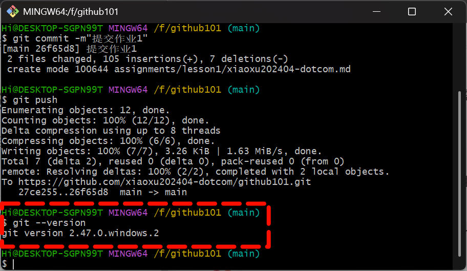

# Git工具安装与使用报告

## 学员GitHub用户名: xiaoxu202404-dotcom

## 1. Git安装过程

我主要在 Windows 11 操作系统上完成 Git 的安装，具体过程如下：

1. 

   **访问官网**：首先，我通过浏览器访问 Git 的官方网站 https://git-scm.com/。

2. 

   **下载安装包**：在官网首页，点击蓝色的 "Download for Windows" 按钮，系统会自动开始下载最新版本的 Git for Windows 安装程序（文件名通常为 `Git-x.x.x-64-bit.exe`）。

3. 

   **运行安装程序**：下载完成后，以管理员身份运行该安装程序。

4. 

   **遵循安装向导**：安装向导界面非常清晰，我基本上遵循了默认设置：

   - 

     **许可协议**：阅读并同意 GNU 通用公共许可证。

   - 

     **安装路径**：使用默认的安装路径 `C:\Program Files\Git`。

   - 

     **组件选择**：默认勾选了所有组件，包括 Git Bash、Git GUI 等，我保持不变。

   - 

     **默认编辑器**：我选择了安装包内置的 Vim 作为默认编辑器。

   - 

     **调整 PATH 环境**：我选择了推荐的选项 "Git from the command line and also from 3rd-party software"，这会将 Git 添加到系统的 PATH 变量中，方便在任何命令行终端（如 CMD 或 PowerShell）中直接使用 `git`命令。

   - 

     **HTTPS 传输后端**：使用 OpenSSL 库。

   - 

     **行尾符转换**：选择默认的 "Checkout Windows-style, commit Unix-style line endings" 选项，这能很好地处理跨平台协作时的行尾符问题。

   - 

     **终端模拟器**：选择使用 Git Bash 的默认终端 MinTTY。

   - 

     **其他选项**：对于 `git pull`的默认行为和其他实验性选项，我均保持默认设置。

5. 

   **完成安装**：点击 "Install" 开始安装。安装完成后，取消勾选 "View Release Notes"，并点击 "Finish" 退出向导。

## 2. 遇到的问题及解决方法

整个安装过程非常顺利，没有遇到技术性问题。但在安装完成后进行初始配置时，新手可能会忽略一个关键步骤，我也同样遇到了：

- 

  **问题**：安装完成后，我立即尝试执行 `git commit`命令，系统提示需要配置全局的用户名和邮箱地址，否则无法成功提交。

  ```
  Author identity unknown
  *** Please tell me who you are.
  Run
    git config --global user.email "you@example.com"
    git config --global user.name "Your Name"
  to set your account's default identity.
  ```

- 

  **解决方法**：根据提示，我使用 `git config`命令进行全局配置。在 Git Bash 或任何命令行终端中执行以下命令（将信息替换为自己的 GitHub 账户信息）：

  ```
  git config --global user.name "xiaoxu202404-dotcom"
  git config --global user.email "你的邮箱@example.com"
  ```

  这个配置信息会写入到你的每一次提交记录中，是身份识别的关键。

## 3. 版本信息截图

（在此处插入执行`git --version`命令后的截图）

*请在此插入您的截图，图示应为：*



## 4. Git命令使用过程总结

通过实际操作，我对 Git 的基本工作流程有了更深入的理解。整个过程可以概括为：从远程仓库获取代码 -> 在本地进行修改 -> 将修改记录并同步回远程仓库。

```
flowchart LR
    A[工作目录] <--修改文件--> B[暂存区<br>git add]
    B --生成提交--> C[本地仓库<br>git commit]
    C --推送更新--> D[远程仓库<br>git push]
    D --获取更新--> A
```

以下是我对核心命令的使用体验和理解：

- 

  **git clone [url]**

  - 

    **体验**：这是与远程仓库交互的第一个命令，非常直接。通过提供的仓库 HTTPS 或 SSH 地址，即可将整个项目及其历史记录完整地下载到本地的一个新建目录中。

  - 

    **理解**：它本质上是完成了初始化本地仓库、添加远程地址（默认名为 `origin`）和首次 `git pull`的综合操作。

- 

  **git add [file]**

  - 

    **体验**：在本地修改或新增文件后，需要使用此命令将文件的变化“预约”到下一次提交中。可以使用 `git add .`来添加所有变更。

  - 

    **理解**：Git 的工作区、暂存区（Index）和仓库是三个核心概念。`git add`就是将工作区的变化添加到暂存区，这是一个准备提交的“快照区”。

- 

  **git commit -m "commit message"**

  - 

    **体验**：将暂存区的内容正式提交到本地仓库，生成一个唯一的提交哈希（如 `f7b3d1a`）。提交信息 `-m`后的描述必须清晰，说明本次提交的目的。

  - 

    **理解**：提交是 Git 的精华所在。每一次提交都是项目的一个完整快照，并包含指向其父提交的指针，从而形成了可追溯的历史记录。它目前只影响本地仓库。

- 

  **git push [remote] [branch]**

  - 

    **体验**：将本地仓库中的提交记录上传到远程仓库（如 GitHub）。通常命令是 `git push origin main`，表示将本地的 `main`分支推送到远程 `origin`仓库。

  - 

    **理解**：这是团队协作的关键命令。只有执行了 `push`，你的代码才会被团队其他成员看到和获取。如果在他人在你之前推送了更新，你需要先执行 `git pull`来合并他们的更改。

- 

  **git pull [remote] [branch]**

  - 

    **体验**：从远程仓库获取最新的更新并自动合并到当前本地分支。它是我开始工作前的好习惯，确保基于最新代码进行开发。

  - 

    **理解**：`git pull`实际上是两个命令的组合：`git fetch`（获取远程最新数据）和 `git merge`（将数据合并到当前分支）。有时合并会产生冲突，需要手动解决。

**总体感受**：Git 的学习曲线初期可能有些陡峭，但一旦理解了其分布式版本管理的核心思想和工作区、暂存区、仓库的关系，就会发现它的设计非常强大和灵活。它不仅是代码备份工具，更是团队协作和项目历史管理的基石。